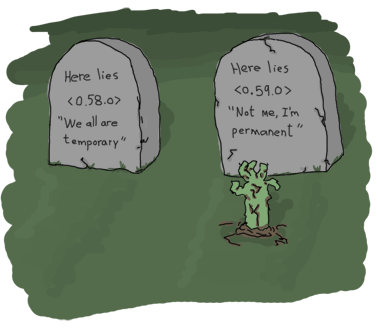

## Intro to Elixir

Barcelona, July, 2017

[Carlos I. Peña](http://linkedin.com/in/carlosipe) / [@carlosipe](https://github.com/carlosipe)

<a href="https://camaloon.com" style="color:white">

<br>Camaloon.com
</a>

---

## What?

Elixir is a dynamic, functional language designed for building scalable and maintainable applications.

Elixir leverages the Erlang VM, known for running low-latency, distributed and fault-tolerant systems, while also being successfully used in web development and the embedded software domain.

| https://elixir-lang.org |

---

## Why?
<ul>
<li class="fragment"> I mean: why should we learn Elixir? </li>
</ul>

---

### Developer happiness
- Fun to write
- Easy to delete code (no need to refactor!)

---

## It's Ruby, oh yeah!

```elixir
defmodule Hello do
  def greet(name) do
    "Hello #{name}"
  end
end

Hello.greet("Carlos")
#> "Hello Carlos"
```

---

## It's not Ruby!

- It's a functional language. No objects
- Functions are just data mappers

```elixir
prime = fn(x) -> y
    1 -> 2
    2 -> 3
    3 -> 5
    4 -> 7
    5 -> 11
    6 -> 13
...
```

---

```elixir
defmodule Customer do
  def name(customer) do
    case customer do
      customer1 -> "Alice"
      customer2 -> "Bob"
      _         -> "Don't know"
    end
  end
end
...
```

---

- No data encapsulation. Data is always explicit. We transform it.

```elixir
credentials           # %{client_id: "x", client_secret: "y"}
|> API.access_token   # "xz123asdfasd"
|> API.request("/me") # %{id: 10, name: "John Doe", ...}
|> Map.get(:name)     # "John Doe"
|> Enum.at(0)         # "John"
|> Hello.greet        # "Hello John"

# Isn't beautiful the pipe operator?
```

---

## Different paradigm

- There's no objects 
- There's no state. It's only functions

- Functions are easily composable. "Where do I put this helper code?" "Wherever"

---

## Second part: Distributed computing

Why is this important?

---

## Web development:
- Handling concurrent requests
- Async work
  - mailing
  - dw processing
  - synchronizing data with third services
- Microservices 
- Web scraping: never try to do it from Ruby. It just doesn't work

---

## Distributed programming is difficult:
- Shared state ruins everything (and objects mix state and behaviour)
- Handling mutex and locks is difficult without the right abstractions

---

### It's very easy to spawn a thousand processes
### The hard parts are:
  - Handling failures
  - Locking shared resources

---

## Open Telecom Platform (OTP)

The Right Abstractions™ for microservices 
  - Processes
  - Mailboxes
  - Timeouts
  - Generic Servers
  - Supervisors
  - Let it crash philosophy

---

## Too much talk: let's code


---

## Basic processes:

`iex code_examples/ping.exs`
- receive
- send(pid, :ping)
- Process.exit(pid, :kill)
- Process.alive?(pid)

---

## GenServer and Supervisor

https://github.com/carlosipe/mercadolibre_ex



---

## Plug

1. A specification for composable modules between web applications (think of Rack in Ruby)
2. Connection adapters for different web servers in the Erlang VM

https://github.com/carlosipe/elixir-plug-example

---

## Ecto

- Schemas
- Queries
- Changesets
- Validations and constraints
- Note about ROM
https://github.com/carlosipe/ecto_playground

---

## Phoenix

"A productive web framework that does not compromise speed and maintainability"
- You can be as productive as in Rails
- It's full batteries included
  - Plug (including websockets) Scales really well. Rails ActionCable doesn't scale.
  - Ecto
  - View Rendering

---

## Phoenix

  - Assets management: (default delegated to brunch.js)
  - Mailer: you can use bamboo
  - Image uploading/processing: you can use Arc
  - PDF generation: gutenex
  - and so on...

---

## Conclusion:

Nice things:
- Really easy to write code (as friendly as Ruby)
- Functional mindset: inmutability + separation between state and behaviour
- Fault tolerance and decoupling:
  - Basic abstractions make you think about dependencies
  - Decoupling means it's easy to change, delete and scale

---

## Conclusion:

- Good ecosystem, friendly community
- Good performance
  - Cache layers no needed anymore

Bad things:
- It's not as performant as Go or Rust or x...
  - * In some tasks it's more performant than Go
- ...
- ...

---

## Thanks

- https://github.com/carlosipe/elixir_plug_example
- https://github.com/carlosipe/ecto_playground
- https://github.com/carlosipe/mercadolibre_ex
- http://ruby2elixir.github.io/posts/2015/12-29-what-makes-elixir-so-attractive-for-some-developers.html
- http://sorentwo.com/2016/02/02/caching-what-is-it-good-for.html
